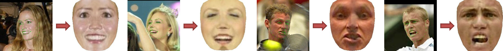

# Fan-C Face Frontalization

This repository contains the original implementation of the face normalization method Fan-C described in the following paper.
Please cite the paper if you use this code, our trained models, and/or the SyLaFaN dataset.

> Philipp Werner, Frerk Saxen, Ayoub Al-Hamadi, and Hui Yu, ["Generalizing to Unseen Head Poses in Facial Expression Recognition and Action Unit Intensity Estimation"](https://www.researchgate.net/publication/332979114), IEEE International Conference on Automatic Face and Gesture Recognition (FG), 2019.

In the paper the method is called "FaNC", but we like to pronounce it as "fancy" and that is why we prefer to write it as "Fan-C" now.
The acronym stands for "**Fa**ce **N**ormalization based on Learning **C**orrespondences".
The key idea is to predict coordinates and visibilities of correspondence points from facial landmarks in both the arbitrary-pose source domain and the frontal target domain.
The predicted information is used to generate a face image that is normalized regarding pose and facial proportions.
Fan-C can be learned and applied on top of any landmark localizer, also without facial contour landmarks, and is very fast.
(With our unpublished OpenGL implementation it runs in less than 2 ms even on old and cheap on-board GPUs.)
You can find more details in the [paper full-text](https://www.researchgate.net/publication/332979114) or get a more detailed overview through our [poster](https://www.researchgate.net/publication/333209907).

This repository includes matlab source code to test the Fan-C face normalization on the SyLaFaN dataset and the LFW database.
It also provides code for training a new Fan-C model, which allows to use other training data, parameters, or landmark sets.
The repository does not include the used face detection and landmark localization code and models.
If you want to build the full processing pipeline, you can find the models and code in our [ICCV 2017 Real vs Fake Emotion Recognition Challenge repository](https://github.com/fsaxen/NIT-ICCV17Challenge).
In this repository, see point 4 of the README for the model download link, 1c++/src/detectFace.cpp for the face detection code, and 1c++/src/detectAUsOld.cpp for the landmark localization code.

## Requirements

To run the code you need:

- Matlab (tested with 2014a and some newer versions)
- Our SyLaFaN dataset and/or our pre-trained models
- For training: a matlab-supported C compiler to build liblinear

## Getting started

**Caution: Please note that the SyLaFaN dataset and our pre-trained models are only available for non-commercial research purposes, because they are based on a non-commercial academic licence of [FaceGen](https://facegen.com/).**

1. Download/unpack or clone this repository
2. Download the [SyLaFaN Dataset](http://wasd.urz.uni-magdeburg.de/pwerner/fan-c/DB_SyLaFaN.zip)
3. Download the [pre-trained Fan-C models](http://wasd.urz.uni-magdeburg.de/pwerner/fan-c/fan-c-models.zip)
4. Optionally, download the [Labeled Faces in the Wild (LFW) database](http://vis-www.cs.umass.edu/lfw/lfw.tgz) (if you want to see cross-database results)
5. Extract the contents of the ZIP files into the root directory of this repository
6. Run the scripts in the root directory

